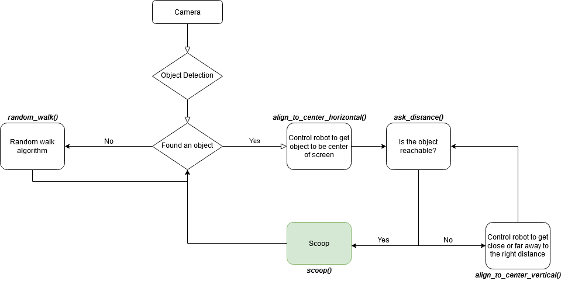

# Chad-Core

Object Detection and Distance Estimation Module for Chad Bot

### Description
This repo holds the source code for much of the Object Detection and Distance Estimation functionality for Chad. 

The source code is written and designed for:
1. Jetson TX2
1. Arduino Uno Mega

### Current Design

### Pre-requisites:
After cloning this repo on the TX2, you must run `./pre-install-script.sh` in order to install the required software packages.
1. `chmod +x pre-install-script.sh`
1. `sudo ./pre-install-script.sh`

### Required Software Packages:
#### Python: (TX2 Optimized)
1. Tensorflow 
1. OpenCV

### Issues:
1. `ld -lGL` not found.
    1. https://devtalk.nvidia.com/default/topic/1051923/jetson-tx2/make-error-usr-bin-ld-cannot-find-lgl-/post/5339745/#5339745
        1. You may have to specify the full path on libGL.so
            1. `sudo ln -sfn libGL.so.1.0.0 /usr/lib/aarch64-linux-gnu/libGL.so`

## How to run:
`python detect-net.py --camera=/dev/video1`
